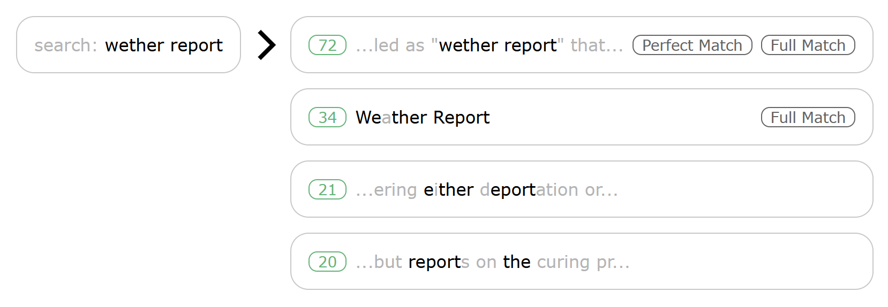
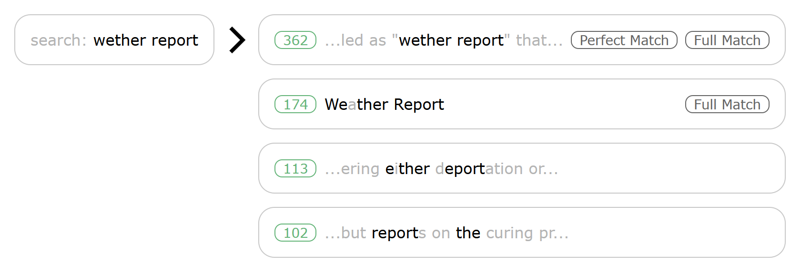

# FuzzySearch

An in-browser, client-side search engine.

```html
<script src="FuzzySearch.min.js"></script>
<script>
const instance = new FuzzySearch();
instance.init( myData );
instance.search( "Find this" ).then( results => ... );
</script>
```

FuzzySearch matches results that are "pretty close", while precise scores and categories let you fine-tune for your use-case.



# Tiny & Fast

FuzzySearch is under 14kb, uses multi-threading for search, and is highly optimized for fast execution and careful memory management.

# Index

- [Usage](#usage)
    - [Instantiate](#instantiate)
    - [Initialize](#initialize)
    - [Search](#search)
    - [Use Results](#use-results)
- [Constructor Options](#constructor-options)
    - [SCORE_WIDTH_BYTES](#score_width_bytes)
    - [DATA_WIDTH_BYTES](#data_width_bytes)
    - [FORCE_SINGLE_THREAD](#force_single_thread)
    - [FUZZY_RESOLUTION](#fuzzy_resolution)
- [Init Parameters](#init-parameters)
    - [data](#data)
    - [keys](#keys)
    - [copy](#copy)
        - [direct](#direct)
        - [ascii-words](#ascii-words)
        - [ascii-code](#ascii-code)
- [Search Parameters](#search-parameters)
    - [target](#target)
    - [limit](#limit)
- [Results Usage](#results-usage)
    - [Result Structures](#result-structures)
        - [String Array Results](#string-array-results)
        - [Object Array Results](#object-array-results)
    - [Score Types](#score-types)
        - [Perfect](#perfect)
        - [Full](#full)
        - [Fuzzy](#fuzzy)
- [Example](#example)

# Usage

## Instantiate

Create a FuzzySearch instance.
```javascript
const fuzzyInstance = new FuzzySearch();
```
Each instance runs search on a separate web worker.  
By creating multiple instances, you can run multiple searches in parallel.

You can also specify internal data sizes and force FuzzySearch to use synchronous search. See [constructor options](#constructor-options).

## Initialize

Send your searchable data to your FuzzySearch instance for loading.
```javascript
fuzzyInstance.init( myDataArray );
```

Your data can be an array of strings.
```javascript
const myDataArray = [
    "Searchable string 1.",
    "Another searchable string.",
    "..."
]
```
Or your data can be an array of objects with strings in fields.
```javascript
const myDataArray = [
    { title: "Helpful Searches", tags: "self-help, popular" },
    { title: "Looking for Stuff", tags: "tutorial, fiction" },
    { ... }
]
```

You can limit your loading to specific fields, control case, collapse whitespace, and skip data validation at deployment to maximize performance. See [initialization parameters](#init-parameters).

## Search

Use a string to perform an asynchronous search and get results.
```javascript
const results = await fuzzyInstance.search( "string to search for" );
```

You can limit the number of results, and initialization parameters will effect the structure of the results. See [search parameters](#search-parameters) and [results usage](#results-usage).

## Use Results

When searching an array of strings, results list indices and scores.  
Higher scores are better matches.  
```javascript
const results = await fuzzyInstance.search( "string to search for" );
const fuzzyList = results.fuzzy;
for( let result of scoredList ) {
    console.log(
        result.score,
        result.index,
        myData[ result.index ]
    )
}
```

`"fuzzy"` lists all "close" results, while `"perfect"` lists only perfect matches.  
Scores higher than 1 contain multiple perfect matches.
```javascript
const perfectList = results.perfect;
for( let result of perfectList ) {
    console.log(
        result.score,
        result.index,
        myData[ result.index ]
    )
}
```

For full result category descriptions and structural differences when searching object fields, see [results usage](#results-usage).

# Constructor Options

The FuzzySearch constructor accepts an options parameter with 4 keys.

```
const options = {
        SCORE_WIDTH_BYTES: unset | 2 | 4
        DATA_WIDTH_BYTES: unset | 2 | 4
        FORCE_SINGLE_THREAD: unset | boolean
        FUZZY_RESOLUTION: unset | ( int > 0 )
    },
    fuzzyInstance = new FuzzySearch( options )
```

## SCORE_WIDTH_BYTES

```javascript
const options = {
    SCORE_WIDTH_BYTES: 2
}
```

Set to 2 or 4.  
Defaults to 2 if unset.

Controls the size allocated for storing each score value, which in turn controls the maximum precision of score values.  
2-byte scores have a maximum value of 2^16.  
4-byte scores have a maximum value of 2^32, but require twice the memory.  

Do not set to 4 unless your search result scores are overflowing the 16-bit limit, which can happen at high values of [FUZZY_RESOLUTION](#fuzzy_resolution).  

## DATA_WIDTH_BYTES

```javascript
const options = {
    DATA_WIDTH_BYTES: 2
}
```

Set to 2 or 4.  
Defaults to 2 if unset.

Controls the size allocated for storing each character in your searchable data strings and in your search target string.  
Defaults to 2, which can represent all 16-bit Unicode values.  

Do not set to 4 unless you have confirmed that your data strings or search target strings contain characters outside this range.  
Doubling memory requirements, especially for large data sets, can cause memory allocation (and searching) to fail on memory-constrained devices.

## FORCE_SINGLE_THREAD

```javascript
const options = {
    FORCE_SINGLE_THREAD: false
}
```

Set to true or false.  
Defaults to false if unset.

If set to true, FuzzySearch will not create a web worker, and will run searches on the main thread.

Do not set to true unless you confirm that your use case does not support worker threads. Worker threads currently have over 97% penetration rate across platforms, see [caniuse.com Web Workers](#https://caniuse.com/#feat=webworkers).

## FUZZY_RESOLUTION

```javascript
const options = {
    FUZZY_RESOLUTION: 200
}
```

Set to an integer greater than zero.  
Defaults to 200 if unset.  

Raising the resolution will raise scores overall.  

If you are generating many search results, raising the resolution will prevent ties (results with the same score).  
However, raising the resolution can cause overflow, where the largest scores exceed the capacity specified by [SCORE_WIDTH_BYTES](#score_width_bytes).

The ratio of scores remain the same.  
Scores rise linearly with resolution.  

At FUZZY_RESOLUTION: 200


At FUZZY_RESOLUTION: 1000




# Init Parameters

Only the data parameter is required.

```
const instance = FuzzySearch.init(
    data: array[string] | array[ object{*:string} ]
    keys: unset | array[string]
    copy: unset | "direct" | "ascii-words" | "ascii-code"
    fast: unset | boolean
)
```

## data

Data can be an array of strings.
```javascript
const data = [
    "search string 1",
    "search string 2",
    "..."
]
const instance = new FuzzySearch();
instance.init( data );
```

Or, data can be an array of objects with keys paired to strings.
```javascript
const data = [
    { key: "string", key2: "string" },
    { key: "string", key2: "string" },
    ...
]
```

If you do not specify the [keys](#keys) parameter, keys will be inferred from the first object in the array.  
Any key of data[ 0 ] that pairs to a string must also exist and be paired to a string on all subsequent objects in the data array.  
Any keys not paired to strings on data[ 0 ] will be ignored in subsequent objects in the data array.

This will fail to initialize:
```javascript
const data = [
    { key: "string", key2: "string" },
    { key: "string" }, //Initialization fails. Missing "key2".
    ...
]
```

This will initialize, but "key2" will not be searched:
```javascript
const data = [
    { key: "string" },
    { key: "string", key2: "string" }, //"key2" will be ignored.
    ...
]
```

## keys

When initializing an array of objects, the keys parameter controls which keys will be searched.
```javascript
const keys = [ "key1", "key2", ... ]
const instance = new FuzzySearch();
instance.init( data, keys );
```

When initializing an array of strings, the keys parameter is ignored.

If keys is specified, all objects in the data array must define each key with a string or instantiation will fail.

This will fail to initialize:
```javascript
const data = [
        { key: "string" }, //initialization fails. Missing "key2"
        ...
    ],
    keys = [ "key", "key2" ]
const instance = new FuzzySearch();
instance.init( data, keys );
```

This will initialize. "key2" will not be searched:
```javascript
const data = [
        { key: "string", key2: "string" }, //"key2" will be ignored.
        ...
    ],
    keys = [ "key" ]
const instance = new FuzzySearch();
instance.init( data, keys );
```

## copy

The copy parameter allows conversion of searchable data strings and search target strings to 2 specialized use-case formats: "ascii-words" and "ascii-code".  

Defaults to "direct".

```javascript
const copy = "direct";
const instance = new FuzzySearch();
instance.init( data, keys, copy );
```

### direct

Data is copied literally, including case and whitespace.

```
"W" and "w" will not match in a search.
"i    t" and "i t" will not match perfectly in a search.
```

### ascii-words

```javascript
const copy = "ascii-words";
const instance = new FuzzySearch();
instance.init( data, keys, copy );
```

Only alphanumeric ASCII characters are searched, capital letters will be searched as lowercase, and whitespace will be collapsed into a single space (0x20).

```
"What's     This?" will be searched as "whats this".
```

### ascii-code

```javascript
const copy = "ascii-code";
const instance = new FuzzySearch();
instance.init( data, keys, copy );
```

ASCII whitespace will be collapsed into a single space (0x20) when searched, and ASCII capital letters will be searched as lowercase. All other characters will be copied directly.

Only these 6 ASCII whitespace characters will be collapsed.
- space ( ' ' ) - ASCII code: 0x20
- horizontal tab ( '\t' ) - ASCII code: 0x09
- line feed ( '\n' ) - ASCII code: 0x0a
- vertical tab ( '\v' ) - ASCII code: 0x0b
- form feed ( '\f' ) - ASCII code: 0x0c
- carriage return ( '\r' ) - ASCII code: 0x0d
```
"       a >=    b;" will be searched as " a >= b;"
```

## fast

Defaults to false.
Set to true **only** for deployment with **validated data**.
```javascript
const fast = false;
const instance = new FuzzySearch();
instance.init( data, keys, copy, fast );
```

FuzzySearch includes validation checks for parameters. These checks prevent search table corruption at instantiation.  
However, they are extremely costly to performance.  

If you are deploying validated data for searching, or if you are generating data from validity-enforcing code, or if you have a validating pipeline in place, disable these internal checks to speed initialization.

Because validation only happens at instantiation, this parameter has no effect on search speed, only load speed.

FuzzySearch's algorithm behavior on malformed, unvalidated data is undefined.

# Search Parameters

Only the target string parameter is required.

```
const results = await instance.search(
    target: string
    limit: unset | int
)
```

## target

The target string will be compared against initialized data to generate scored results.

```javascript
const instance = new FuzzySearch();
instance.init( data, keys, copy, fast );
const searchTarget = "a string to search for";
const results = await instance.search( searchTarget );
```

## limit

Set to an integer to limit the maximum number of search results per category.  
Defaults to 10.

```javascript
const instance = new FuzzySearch();
instance.init( data, keys, copy, fast );
const searchTarget = "a string to search for",
    limit = 5;
const results = await instance.search( searchTarget, limit );
const fullList = results.full;

fullList.length <= 5; //true
```

# Results Usage

The information in a results object answers 4 questions:
1. What field of your data did the results come from? (key)
2. How were results scores calculated? (perfect, full, or fuzzy)
3. What data entry did your results come from? (index)
4. What was the computed score? (score)

For searching an array of strings (no keys):
```
results = {
    perfect: [ { score, index }, { score, index }, ... ],
    full: [ { score, index }, { score, index }, ... ],
    fuzzy: [ { score, index }, { score, index }, ... ]
}
```
For searching an array of objects (with keys):
```
results = {
    key1: {
        perfect: [ { score, index }, { score, index }, ... ],
        full: [ { score, index }, { score, index }, ... ],
        fuzzy: [ { score, index }, { score, index }, ... ]
    },
    key2: {
        perfect: [ { score, index }, { score, index }, ... ],
        full: [ { score, index }, { score, index }, ... ],
        fuzzy: [ { score, index }, { score, index }, ... ]
    },
    ...
}
```

## Result Structures

There are 2 result structures, 1 for searching an array of strings, and 1 for searching an array of objects.

### String Array Results

When searching an array of strings, the results contain 3 lists, 1 for perfect scores, 1 for full scores, and 1 for fuzzy scores.
```javascript
const data = [ "string", "... " ];
const instance = new FuzzySearch();
instance.init( data );
const results = await instance.search( "search string" );
/*
results === {
    perfect: [...],
    full: [...],
    fuzzy: [...]
}
*/
```
Each list entry contains a score and an index into your data strings array.
```javascript
//search a data set containing "string" and "words"
const data = [ "string", "words" ];
const instance = new FuzzySearch();
instance.init( data );

//search for "string" returns index 0.
const resultsA = await instance.search( "string" );
const indexA = results.perfect[ 0 ].index;
const scoreA = results.perfect[ 0 ].score;
indexA === 0; //true
data[ indexA ] === "string"; //true
scoreA; //a number

//search for "words" returns index 1.
const resultsB = await instance.search( "words" );
const indexB = results.perfect[ 0 ].index;
const scoreB = results.perfect[ 0 ].score;
indexB === 1; //true
data[ firstIndex ] === "words"; //true
scoreB; //a number
```

### Object Array Results

When searching an array of objects, FuzzySearch performs 1 search for each field.  
The results contains 1 results object for each field key.
```javascript
const data = [ 
    { key: "string", key2: "string" },
    { key: "string", key2: "string" },
];
const instance = new FuzzySearch();
instance.init( data );
const results = await instance.search( "search string" );
/*
results === {
    key: {
        perfect: [...],
        full: [...],
        fuzzy: [...]
    },
    key2: {
        perfect: [...],
        full: [...],
        fuzzy: [...]
    }
}
*/
```
Each list entry is formatted the same, with a score and an index.
```javascript
//search a data set containing "string" and "words"
const data = [ 
    { key: "string" },
    { key: "words" }
];
const instance = new FuzzySearch();
instance.init( data );

//search for "string" returns index 0 under the "key" property.
const resultsA = await instance.search( "string" );
const keyResults = results.key; //results for "key"
const indexA = keyResults.perfect[ 0 ].index;
const scoreA = keyResults.perfect[ 0 ].score;
indexA === 0; //true
data[ indexA ] === "string"; //true

//search for "words" returns index 1 under the "key" property.
const resultsB = await instance.search( "words" );
const keyResults = results.key; //results for "key"
const indexB = keyResults.perfect[ 0 ].index;
const scoreB = keyResults.perfect[ 0 ].score;
indexB === 1; //true
data[ firstIndex ] === "words"; //true
```

## Score Types

There are 3 kinds of scores for each search: perfect, full, and fuzzy.  
How you use these scores will depend on your use case. Each is useful in its own context.

### Perfect

The results in the perfect list are data strings that matched the input character-for-character.  
The score indicates how many matches.
```
search "hello" in "hello"
perfect score: 1
(1 perfect match)
```
```
search "hello" in "hello, hello, hello!"
perfect score: 3
(3 perfect matches)
```
Although perfect results are the best results, this list will often be empty.
```
search "helo" in "hello"
(no perfect matches)
```

### Full

Results in the full list matched each unique character in the search at least once.
The score is always 1.
```
search "hello" in "helo"
full score: 1
(matched "h", "e", "l", and "o". All unique characters matched.)
```
```
search "aaaaaaa" in "a"
full score: 1
(matched "a". All unique characters matched.)
```
```
search "ab" in "a"
(no full results)
(matched "a". Did not match "b". Not all unique characters matched.)
```

### Fuzzy

Results in the fuzzy list have higher or lower scores depending on how closely the search matched.
```
search "high low" in "My time there had its highs and its lows."
fuzzy score: higher number

search "high low" in "I thought we would have arrived by now."
fuzzy score: lower number

search "5" in "This has no numbers."
fuzzy score: 0
```

# Example

This example loads FuzzySearch, passes it data, performs a search, and logs the scored results to the console.
```html
<script src="FuzzySearch.min.js"></script>
<script>
const myData = [
    { title: "Blue Sky", genre: "fiction" },
    { title: "Green Plants", genre: "textbook" },
    { title: "Black Plague", genre: "history" }
];

const searchEngine = new FuzzySearch();

const keys = [ "title", "genre" ],
    copyMode = "ascii-words";
searchEngine.init( myData, keys, copyMode );

searchEngine.search( "blue" ).then(
    results => {
        const list = results.title.perfect;
        for( let result of list ) {
            const score = result.score;
            const dataIndex = result.index;

            const dataEntry = myData[ dataIndex ],
                dataTitle = dataEntry.title;

            const message = 
                "Got result with score " + 
                    score +
                " for data entry titled " +
                    dataTitle;

            console.log( message );
        }
    }
)
</script>
```